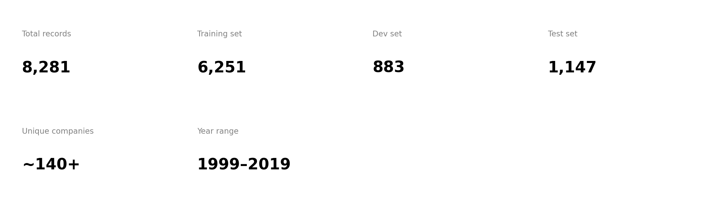

# -finqa-analysis
Financial QA dataset analysis
# FinQA Dataset Analysis

Analysis of the FinQA benchmark dataset for numerical reasoning
over financial documents (SEC filings).

---

## Dataset Overview

| Split | Records |
|-------|---------|
| Train | 6,251 |
| Dev | 883 |
| Test | 1,147 |
| **Total** | **8,281** |
| Unique companies | 140+ |
| Year range | 1999 – 2019 |

---

## Key Findings

### 1. Operation Types
Division dominates financial reasoning:

| Operation | Count | Insight |
|-----------|-------|---------|
| Divide | 622 | Ratios, percentages, per-unit |
| Subtract | 416 | Year-over-year changes |
| Add | 180 | Totals, aggregations |
| Multiply | 80 | Scaling, projections |

> 70% of financial questions require division — reflecting
> how analysts work with ratios like profit margins and EPS.

---

### 2. Reasoning Complexity

| Steps | Count | % |
|-------|-------|---|
| 1 step | 3,717 | 59.5% |
| 2 steps | 2,013 | 32.2% |
| 3 steps | 331 | 5.3% |
| 4+ steps | 190 | 3.0% |

> 60% of questions need only one calculation.
> 8% require 3+ steps — the hardest for AI models.

---

### 3. Top Companies

| Rank | Company | Questions |
|------|---------|-----------|
| 1 | ETR (Entergy) | 363 |
| 2 | UNP (Union Pacific) | 303 |
| 3 | JPM (JPMorgan Chase) | 223 |
| 4 | AMT (American Tower) | 206 |
| 5 | LMT (Lockheed Martin) | 191 |

> Energy and financial sector companies dominate.

---

### 4. Year Distribution
- 1999–2005: Very sparse
- 2006–2011: Growing (includes 2008 crisis data)
- 2012–2018: Peak volume (~470–545/year)
- 2019: Drops sharply (dataset cutoff)
- **2017 had the most questions (545)**

---

## Metric Cards

---

## Project Structure
